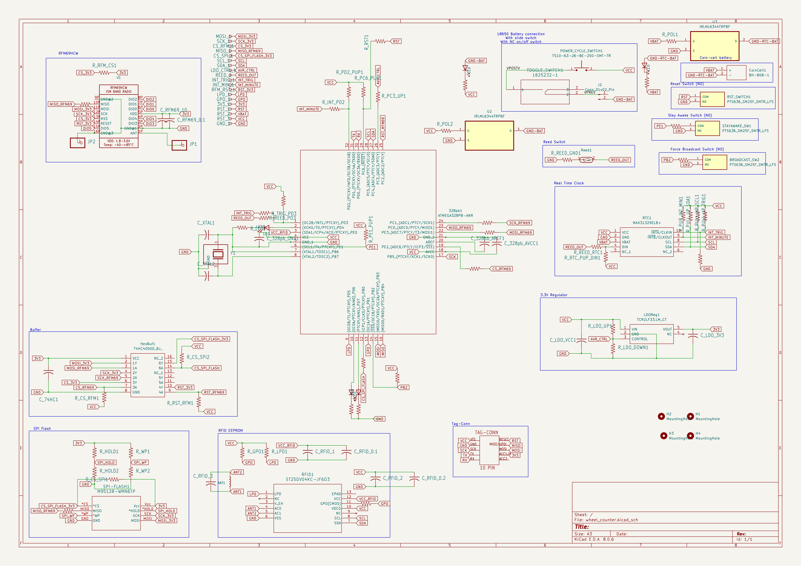
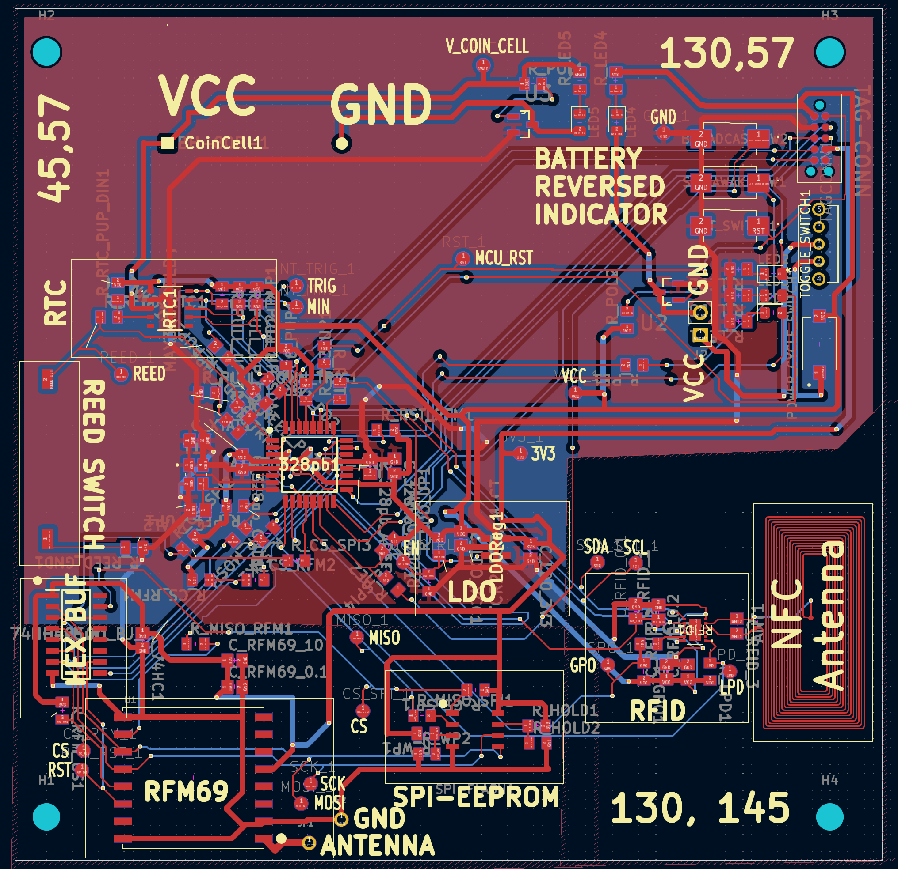

# Wheel Counter, Battery Powered, RFM69 at 433MHz

## Objective
- Monitor how much critters are running on their wheels, at [The Creature Conservancy](http://www.thecreatureconservancy.org/).  Physical activity could correlate with health
- Create a wireless, battery powered, sensing network for additional sensors in the future

## Features
- NFC antenna for quick reading/changing of metadata (i.e. what's the animal name)
- RTC (Real Time Clock)
- N-MOSFET polarity protection
- Several debug switches
- TagConnect interface
  
### Schematic

### PCB

## What's Next
- Populating PCB
- Writing code

## Resources
NFC antenna design taken from [Sparkfun's implementation](https://www.sparkfun.com/products/21274)
Footprints from various sources online, including Sparkfun and Adafruit

